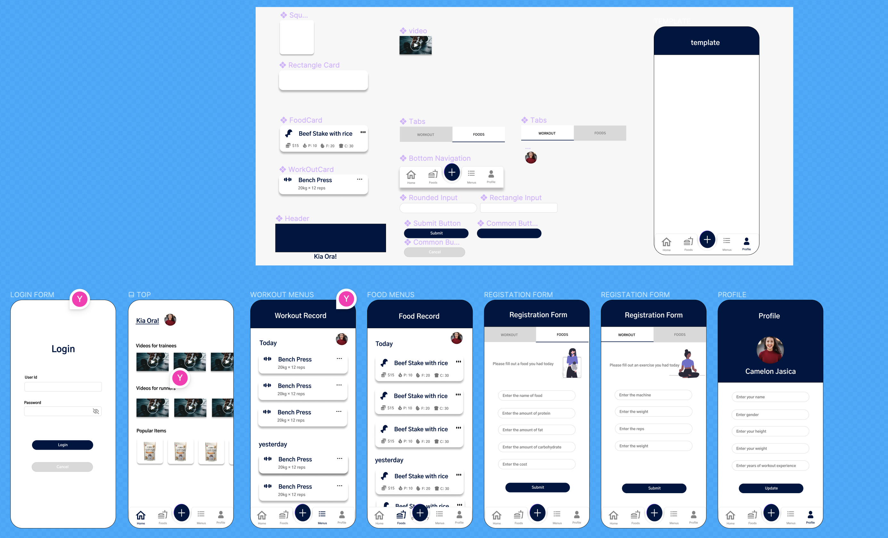

# WorkoutTrackingApp

This app helps trainees to track exercises and meals they do.

## Design

https://www.figma.com/file/7vvfcNq19fBDlVO3i7IVnv/WorkoutApp?node-id=7%3A604&t=3VBsrBVIwm4r6Wpi-1


## Project Setup

```sh
git clone https://github.com/team-agile-div/toyota-wg3trip.git
npm ci
```

### Compile and Hot-Reload for Local Enviroment

```sh
npm run local
```

Also, you can do it by running a build task with `cmd + shift + b`

### Confirm on a mobile

Make sure to utilize the same Wifi as PC does

```sh
npm run local
```

1. Take a note the url coming after `Network: ...`
2. type the url including a port number on the address bar.

### Type-Check, Compile and Minify for Production

```sh
npm run build
```

### Run Unit Tests with [Vitest](https://vitest.dev/)

```sh
npm run test:unit
```

### Run End-to-End Tests with [Playwright](https://playwright.dev)

```sh
# Install browsers for the first run
npx playwright install

# When testing on CI, must build the project first
npm run build

# Runs the end-to-end tests
npm run test:e2e
# Runs the tests only on Chromium
npm run test:e2e -- --project=chromium
# Runs the tests of a specific file
npm run test:e2e -- tests/example.spec.ts
# Runs the tests in debug mode
npm run test:e2e -- --debug
```

## Coding guide

### direcotry structure

Use Atomic design which helps developers to read code easily and also not to lose where to create component files and direcories.

## Deploy

Run by [GitHub Actions](https://github.com/staqct/ssap-partner-portal-fo-frontend/actions)

## Style check and Build check

Run by [GitHub Actions](https://github.com/staqct/ssap-partner-portal-fo-frontend/actions)
